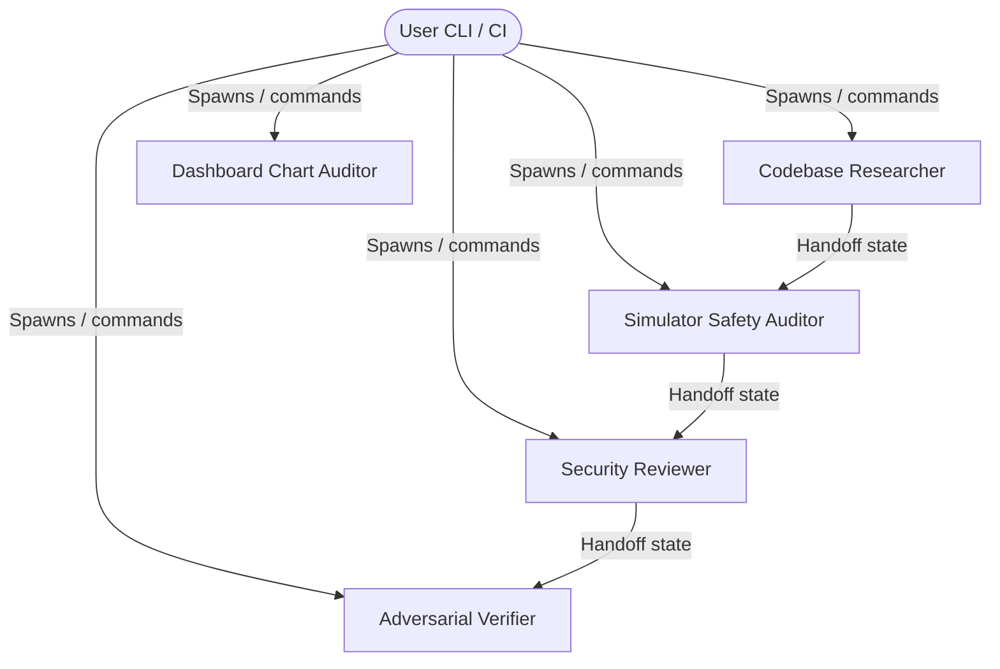

# Framework Multi-Agent Architecture

This document specifies the topology, roles, tools, model calibration, and state handoff contracts for the Claude-native agent environment in the **AI Trading Arena**.

## Agent Topology



---

## Personas & Profiles

### 1. Codebase Researcher
* **Model**: Claude Haiku
* **Effort**: Low
* **Tools**: `Read`, `Grep`, `Glob` (Read-only)
* **Mission**: Explores workspace files, maps dependencies, and traces codebase pathways without execution overhead.

### 2. Simulator Safety Auditor
* **Model**: Claude Opus
* **Effort**: High
* **Tools**: `Read`, `Grep`, `Glob` (Read-only)
* **Mission**: Audits replayability, event sourcing logic, risk-gate boundaries, and Decimal.js money math.

### 3. Dashboard Chart Auditor
* **Model**: Claude Opus
* **Effort**: High
* **Tools**: `Read`, `Grep`, `Glob` (Read-only)
* **Mission**: Audits dashboard data contracts, lightweight-charts rendering, and telemetry WebSocket relays.

### 4. Security Reviewer
* **Model**: Claude Opus
* **Effort**: High
* **Tools**: `Read`, `Grep`, `Glob` (Read-only)
* **Mission**: Audits codebase modifications for credential leaks, real-execution adapters, and OWASP safety.

### 5. Adversarial Verifier
* **Model**: Claude Sonnet
* **Effort**: Medium
* **Tools**: `Read`, `Grep`, `Glob`, `Bash` (Restricted execution)
* **Mission**: Validates changes by compiling, linting, and running Vitest and Playwright test suites. Prohibited from making source code edits.

---

## State Handoff Contract

Agents must save their state, findings, and pending tasks in a JSON file matching `.claude/schemas/handoff.schema.json` before cascading tasks or exiting.

```json
{
  "taskId": "task-12345",
  "status": "success",
  "modifiedPaths": ["packages/broker-paper/src/risk-gate.ts"],
  "testStatus": "passed",
  "nextSteps": ["Verify event log persistence for the rejected order event."]
}
```

---

## Verification Pipeline

Closed-loop verification is enforced via the `verify-changes` command:
1. Run structural audit (`node .claude/workflows/arena-audit.js`).
2. Run typescript typecheck (`pnpm typecheck`).
3. Run eslint checks (`pnpm lint`).
4. Run test suites (`pnpm test`).
